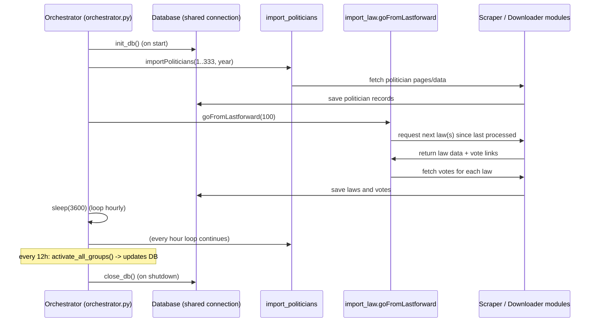

# Orchestrator — Temporal Diagram

This README documents the current runtime data flow for the orchestrator and scraping logic used to import politicians, laws and votes.

## Overview

- The `orchestrator.py` script runs hourly and coordinates three main actions:
  - `import_politicians.importPoliticians(...)` — imports politicians for the current year.
  - `import_law.goFromLastforward(n)` — imports laws (up to `n`) starting from the last processed item.
  - `activate_politicians.activate_all_groups()` — runs every 12 hours.

## Temporal / Sequence Diagram

Below is a small sequence diagram showing the order of events when a cycle runs.

