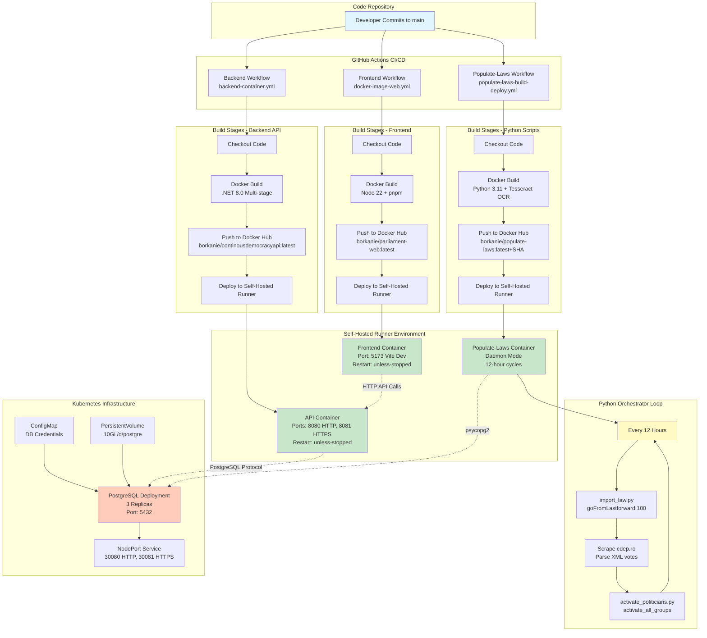
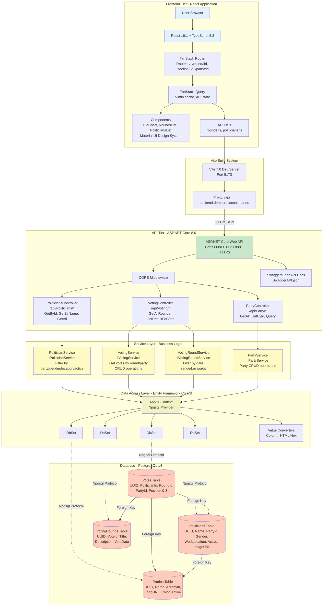

# Continuous-Democracies
This project will allow us to see what the fuck the parlament is doing on our money at all times.

## Architecture

### Deployment Pipeline

The CI/CD pipeline automates the build, containerization, and deployment of all application components using GitHub Actions workflows that trigger on code changes to the main branch. Three parallel workflows handle the backend API (.NET 8), frontend (React/Vite), and data ingestion scripts (Python), building Docker images and deploying them to a self-hosted runner environment. The Python orchestrator runs continuously in a daemon container, executing 12-hour cycles to scrape new voting data from the Romanian Parliament website (cdep.ro), import laws and votes, and update politician active status. All components are containerized with specific images (`borkanie/continousdemocracyapi:latest`, `borkanie/parliament-web:latest`, `borkanie/populate-laws:latest+SHA`) and deployed alongside a Kubernetes-managed PostgreSQL cluster with 3 replicas and persistent storage.

**Key Components:**
- **GitHub Actions Workflows**: `backend-container.yml` (API on ports 8080/8081), `docker-image-web.yml` (Frontend on port 5173), `populate-laws-build-deploy.yml` (Python daemon)
- **Build Stages**: Code checkout → Docker build → Push to Docker Hub → Deploy to self-hosted runner with automatic container restart
- **Python Orchestrator**: 12-hour loop executing `import_law.goFromLastforward(100)` to fetch new voting rounds, then `activate_all_groups()` to update politician status
- **Database Infrastructure**: PostgreSQL 14 with 3 replicas, 10Gi persistent volume (`/d/postgre`), exposed on port 5432 via Kubernetes NodePort service
- **Deployment Target**: Self-hosted GitHub Actions runner with Docker runtime, automatic container lifecycle management (stop old → pull latest → run new)
- **Image Versioning**: Backend and frontend use `latest` tag only; populate-laws uses both `latest` and commit SHA for rollback capabilities
- **Environment Configuration**: Database credentials (`DBSERVERADDRESS`, `DBNAME`, `DBUSER`, `DBPASSWORD`) and `LOG_LEVEL` injected via GitHub Secrets
- **Container Restart Policy**: `unless-stopped` for API and frontend ensures automatic recovery; populate-laws runs with `--rm -d` as ephemeral daemon
- **Kubernetes Resources**: ConfigMap for PostgreSQL credentials, PersistentVolume/PersistentVolumeClaim for data persistence, Service definitions for network access



### Application Architecture

The application follows a multi-tier architecture with a React frontend communicating with a .NET 8 REST API that implements a service layer pattern for business logic and Entity Framework Core for data access to a PostgreSQL database. The backend exposes RESTful endpoints for politicians, parties, voting rounds, and individual votes, with comprehensive filtering capabilities documented via OpenAPI/Swagger specification. The frontend uses TanStack Router for navigation and React Query for state management, displaying vote breakdowns with Chart.js pie charts and enabling users to drill down from overall vote results to party-level and individual politician voting records. All data flows through the API layer, which queries the database via Entity Framework Core and returns JSON responses to the React application.

**Key Components:**
- **Frontend Stack**: React 19.1 + TypeScript 5.8 + Vite 7.0 build tool, TanStack Router for routing, TanStack Query for API state management with 5-minute cache
- **API Layer**: ASP.NET Core 8.0 controllers (`/api/Politicians`, `/api/Voting`, `/api/Party`) with Swagger/OpenAPI documentation, CORS middleware, dependency injection for services
- **Service Layer**: `PoliticianService`, `PartyService`, `VotingService`, `VotingRoundService` implementing business logic with filtering by date ranges, keywords, party affiliation, gender, work location
- **Data Access**: Entity Framework Core 8 with Npgsql provider, AppDBContext managing DbSets (Politicians, Parties, VotingRounds, Votes), custom Color value converter for hex storage
- **Database Schema**: PostgreSQL 14 with four core tables—Politicians (UUID, name, party, gender, location, active status, image URL), Parties (UUID, name, acronym, logo, color), VotingRounds (vote ID, title, description, date), Votes (linking politician, round, position: Yes/No/Abstain/Absent)
- **API Endpoints**: GET `/api/Voting/getAllRounds` (with date/keyword filters), `/api/Voting/GetResultForVote` (votes by round), `/api/Politicians/getAllPoliticians` (with party/gender/location filters), `/api/Party/all`
- **Frontend Routes**: `/` (redirects to latest round) → `/round/:roundId` (vote breakdown) → `/section/:sectionId` (party breakdown) → `/party/:partyId` (individual voters)
- **Data Flow**: User interaction → React components → TanStack Query → API HTTP calls (Vite proxy) → ASP.NET Core controllers → Service layer (LINQ queries) → Entity Framework Core → PostgreSQL database → JSON response → Frontend visualization
- **Component Architecture**: React functional components with hooks, Material UI design system, Chart.js for data visualization, TypeScript for type safety across API contracts



## DataBase

It will use PostGRSQL on a kubernetes cluster to make it easy to move into the cloud and have a fast reliable data structure.
The porject will use EntityFramework to run the db. This feature also comes with a caching system that will be sufficient for our usecases.
In order to deploy changes done to model project to db isntance we have to run the follwoing commands in developer console in the folder of the DBManager (ParlimentMonitor.DataBaseConnector):
```
dotnet ef migrations add SomeName
dotnet ef database update
```
This will basically create a new commit and deploy it on the database. The commit can be seen in the intermediate file in the 'Migrations' direcotry inside the project. There the framework converts the changes to C# statements and than we run that on our DB after connecting to it.
Connection string will be saved in "Secrets.cs" file.
